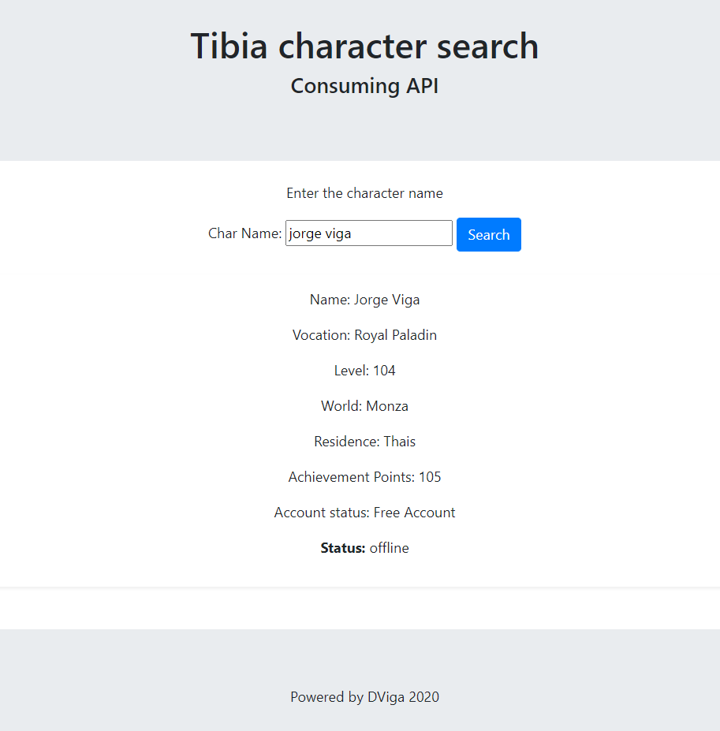

# Consuming API.
### JavaScrit, Bootstrap, HTML

* This is a simple example of how to consume an API.

* Made in a simple web page with HTML, JavaScript and Bootstrap.

* The RESTful API consumed here is from the MMORPG game [Tibia](https://www.tibia.com/mmorpg/free-multiplayer-online-role-playing-game.php).

* The page looks for information of the character chosen by the user

---

tibia_api_js_bootstrap

## Consuming Tibia MMORPG API. Character search - JS and Bootstrap

***

Print screen of usage examples:

